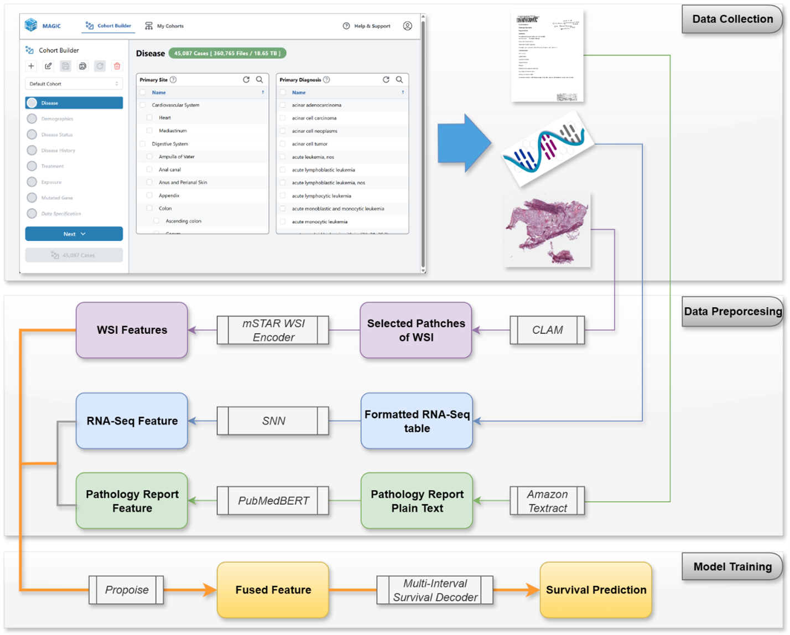
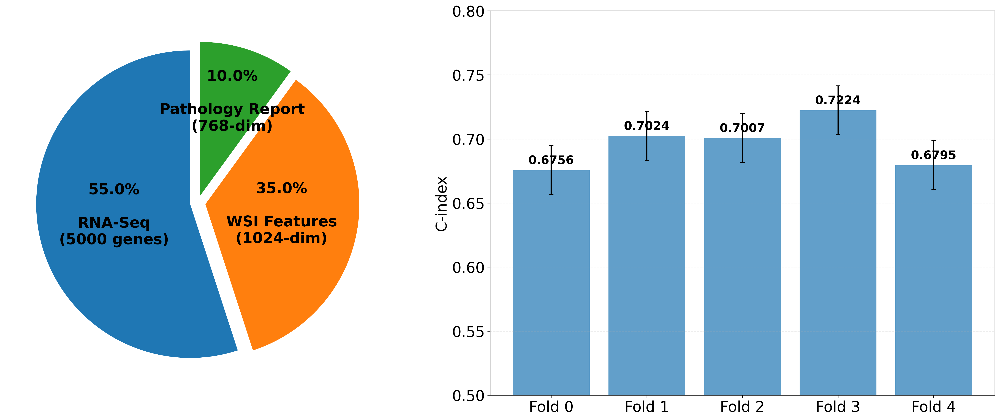

# MAGIC: Multimodal Analysis of Genomics, Imaging and Clinical Data

## 🎯 Overview
This repository supports the [MAGIC](https://magic.polygonhealthanalytics.com/) (Multimodal Analysis of Genomics, Imaging and Clinical Data) platform, enabling users to perform multimodal survival analysis on their own datasets.

In this tutorial, we demonstrate the workflow using an example of squamous cell carcinoma, integrating three key data modalities:
- **Pathology Reports**
- **RNA-Seq Data**
- **Whole Slide Images (WSI)**


*Figure 1: Complete workflow flowchart showing the data processing and analysis pipeline*

## 📋 Prerequisites
Before running this analysis, you need to:
- Download multimodal data from MAGIC platform (clinical, RNA-Seq, pathology reports, and WSI data)
- Python 3.8+ with required packages
- GPU recommended for training (especially for WSI processing)
- Sufficient storage space (~1TB for processed features)
  
## 🚀 Quick Start
1. **Setup Dependencies**: Clone required frameworks (see Setup Dependencies section above)
2. **Data Download**: Obtain SCC multimodal data from MAGIC (Refer to "Task 2: Add Complexity to Your Cohort" on the MAGIC user tutorial page)
3. **Setup Environment**: `pip install -r requirements.txt`
4. **Configuration**: Review and customize `configs/model_config.yaml` if needed
5. **Data Processing**: Run the preprocessing pipeline, `extract_text_features.py` and `process_all_cases.py`.
6. **Model Training**: Execute the 3-modal survival analysis,`scc_3modal_training.py`
7. **Results Analysis**: Evaluate model performance via `generate_predictions.py`

## 🔧 Setup Dependencies

This project requires two external frameworks to be cloned into the project directory:

### 1. mSTAR Framework
```bash
cd mSTAR
git clone https://github.com/Innse/mSTAR.git
```
**Purpose**: Multimodal survival analysis framework for WSI feature extraction and model training.

### 2. CLAM Framework  
```bash
cd CLAM
git clone https://github.com/mahmoodlab/CLAM.git
```
**Purpose**: Patch selection and preprocessing for whole slide images.

## 📊 Data Processing Pipeline

### Step 1: Data Download from MAGIC
- Pathology Report in ".pdf" format
- Whole Slide Image in ".svs" format
- RNA-Seq Data: STAR-aligned gene-level read counts with annotation in ".tsv" format
- Clinical Data, including survival days information in ".json" format

### Step 2: Complete Data Processing

1. **Pathology Report Processing**:
   - OCR Conversion: Amazon Textract extracts plain text from PDF pathology reports
   - Text Cleaning: Remove artifacts and standardize formatting
   - Feature Extraction: PubMedBERT encodes text into 768-dimensional feature vectors

3. **WSI Image Processing**:
   - Patch Selection: CLAM (Clustering-constrained Attention Multiple instance learning) selects informative patches from WSI
   - Feature Extraction: Pre-trained mSTAR WSI encoder extracts 2048-dimensional features from selected patches

4. **RNA-Seq Data Processing**:
   - Normalization: Standard preprocessing applied
   - Format: Compatible with the mSTAR framework

Run *extract_text_features.py* to process pathology reports, then run *process_all_cases.py* to process the WSI and RNA-Seq data. The mSTAR compatible dataset CSV file, including the survival information from clinical data, will be automatically generated when *process_all_cases.py* finishes.

After processing, your data should be organized as follows:
```
data/
├── patients/
│   ├── TCGA-XXXX-XXXX/
│   │   ├── clinical/           # Clinical data (JSON)
│   │   ├── rnaseq/            # RNA-Seq data (TSV)
│   │   ├── pathology/         # Processed pathology text
│   │   ├── wsi/              # Whole slide images (SVS)
│   │   └── features/          # Extracted features
└── processed/                 # Final processed dataset
```

## 🏗️ Model Architecture

### Multimodal Fusion Framework
This analysis is built on the **mSTAR (Multimodal Survival Analysis)** framework, specifically using the `multimodal_survival` module from the mSTAR downstream tasks.

### Model Selection: Porpoise
We selected the **Porpoise model** for this analysis due to its characteristics:
- **RNA-Seq Tolerance**: Handling of RNA-Seq data without requiring signature files
- **Flexible Architecture**: Supports variable gene sets (we use 5000 genes vs MCAT's 753)
- **Bilinear Fusion**: Advanced fusion mechanism for multimodal integration

### Architecture Components
1. **WSI Branch**: Deep Sets + Attention mechanism
2. **RNA-Seq Branch**: SNN (Sparse Neural Network) blocks
3. **Text Branch**: PubMedBERT features
4. **Fusion**: Bilinear fusion of 256-dimensional features
5. **Output**: 4-class survival prediction

### Training Configuration
- **Loss Function**: NLLSurvLoss (Negative Log-Likelihood Survival Loss)
- **Optimizer**: Adam with learning rate 2e-4
- **Scheduler**: Cosine annealing
- **Evaluation**: 5-fold cross-validation with Concordance Index
- **Training**: 40 epochs with batch size 1

## 📈 Results


*Figure 2: Results visualization from the survival prediction analysis*

***Left***: Pie chart showing the contribution of each modality in the multimodal fusion model. ***Right***: Bar plot displaying C-index performance across 5-fold cross-validation. The 3-modal model achieves consistent performance across folds. The C-index 0.6961 ± 0.0170 is comparable to the mSTAR listed benchmark. 

## 🔧 Technical Implementation

### Core Dependencies
- **mSTAR Framework**: Multimodal survival analysis framework
- **CLAM**: Patch selection for WSI processing
- **PubMedBERT**: Pathology text feature extraction
- **Amazon Textract**: OCR for pathology reports

### Environment Setup
```bash
# Install required packages
pip install -r requirements.txt

# Or install individually:
pip install torch torchvision
pip install transformers  # For PubMedBERT
pip install openslide-python  # For WSI processing
pip install pandas numpy scikit-learn
pip install tqdm matplotlib seaborn
...
```

### YAML Configuration File
The `configs/model_config.yaml` file serves as a centralized configuration system for the entire analysis pipeline. 
- **Model Architecture**: Model type, fusion method, output classes
- **Data Modalities**: Feature dimensions for WSI, RNA-Seq, and text
- **Training Parameters**: Learning rate, epochs, optimizer settings
- **Evaluation**: Cross-validation folds, metrics
- **Hardware**: Device settings, number of workers

## 📚 Citations and Acknowledgments

This use case is based on:

```bibtex
@article{mstar2023,
  title={mSTAR: Multimodal Survival Analysis Framework},
  author={...},
  journal={...},
  year={2023}
}

@article{clam2020,
  title={CLAM: Clustering-constrained Attention Multiple instance learning},
  author={Lu, M.Y. and Williamson, D.F.K. and Chen, T.Y. and Chen, R.J. and Barbieri, M. and Mahmood, F.},
  journal={Nature Machine Intelligence},
  volume={2},
  pages={369--378},
  year={2020}
}

@article{pubmedbert2019,
  title={PubMedBERT: A Domain-Specific Language Model for Biomedical Text},
  author={Gu, Y. and Tinn, R. and Cheng, H. and Lucas, M. and Usuyama, N. and Liu, X. and Naumann, T. and Gao, J. and Poon, H.},
  journal={arXiv preprint arXiv:2007.15779},
  year={2020}
}
```

### MAGIC Platform
In collaboration with the NCI and under Contract No. 75N91024C00070, we at Polygon Health Analytics LLC developed MAGIC — the Multimodal Analysis of Genomics, Imaging & Clinical Data tool. MAGIC is designed to help clinicians and researchers seamlessly explore and analyze complex cancer datasets, bridging the gap between data identification and actionable insight. More information can be found from the MAGIC website https://magic.polygonhealthanalytics.com/

## 🤝 Contributing
This repository serves as a demonstration of MAGIC's capabilities to support multimodal data analysis. For questions about the MAGIC platform or data access, please refer to the official MAGIC documentation or reach out to us at info@polygonhealthanalytics.com.

## 🔗 Related Links
- [mSTAR Framework](https://github.com/Innse/mSTAR)
- [CLAM Repository](https://github.com/mahmoodlab/CLAM)
- [PubMedBERT](https://huggingface.co/microsoft/BiomedNLP-BiomedBERT-base-uncased-abstract)
- [TCGA Data Portal](https://portal.gdc.cancer.gov/)

## 📝 Notes
- This repository contains only the analysis code and does not include raw data
- Data must be downloaded separately using MAGIC
- Results may vary depending on the specific dataset and preprocessing steps 
